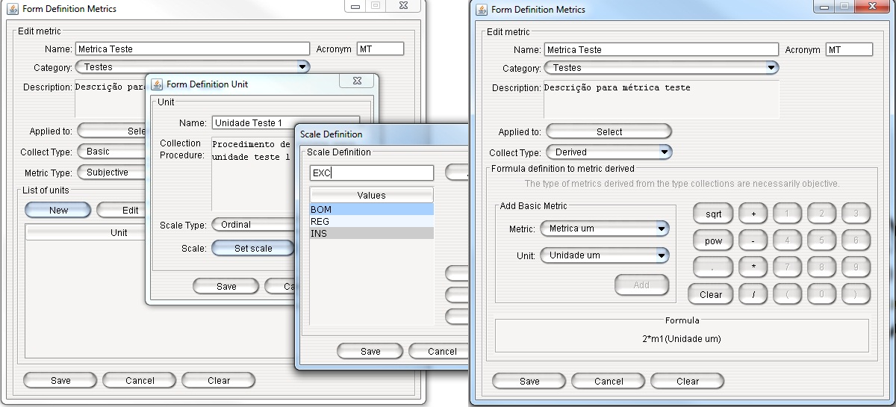
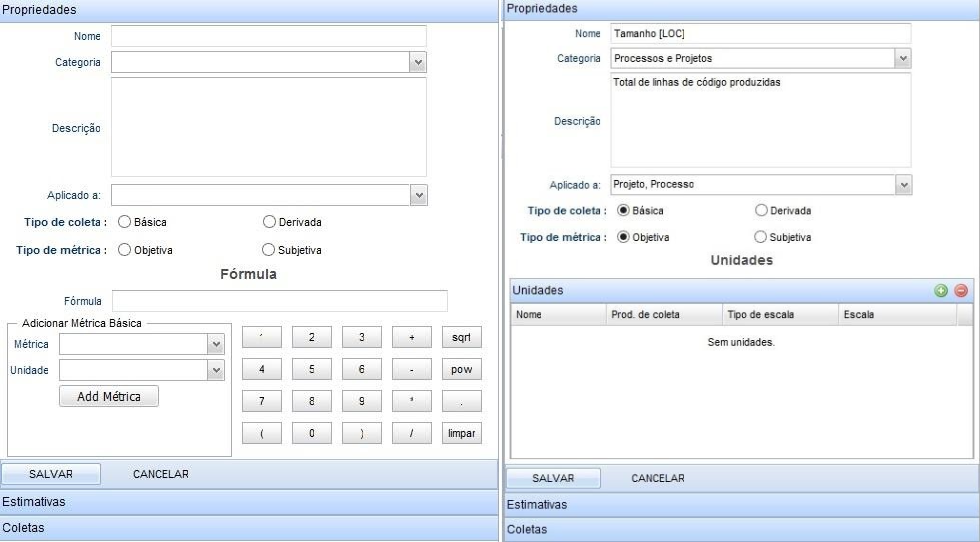
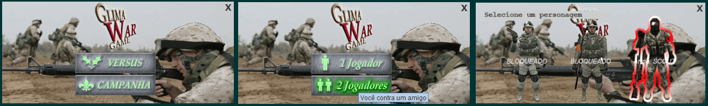
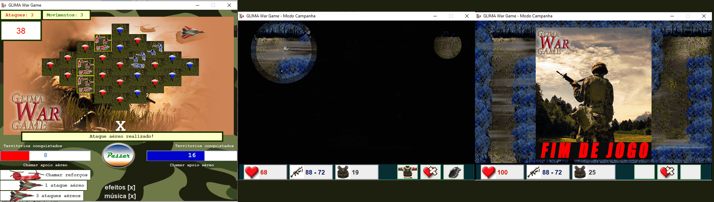

# portfolio

# 2013

Desenvolvimento de um ferramental para definição, estimativa e coleta de métricas de software dentro do ambiente WebAPSSE (ambiente de desenvolvimento de software centrado em processos desenvolvido pelo LABES/UFPA). 
Projeto realizado durante estágio no Laborátorio de Engenharia de Software (LABES/UFPA).

Versão desktop JAVA SE/ SWING

Versão desktop JAVA EE/ GWT (WebAPSEE 2.0)

# 2014

Desenvolvimento de um jogo de tabuleiro (em turnos) em JAVA SE. Este projeto foi criado durante uma disciplina de programação na universidade. Ele sofreu atualizações contantes durante minha gradução e mestrado (não defendido).

Desenvolvimento do modo Versus e utilização de Grafos para modelo dos dados - disciplina de programação e grafos
Desenvolvimento do modo Campanha, aplicação de técnicas de desenvolvimento de Jogos - disciplina de programação 2
Adicão de modo multiplayer (através de uma rede local) - disciplina de redes de computadores.

Adição de um adversário (computador) utilizando a técnica de inteligência artificial - Algoritmos Genéticos - disciplina de inteligência artificial (mestrado).

Glima Wargame tem o código livre e está disponível em um dos meus repositórios.

#2015

